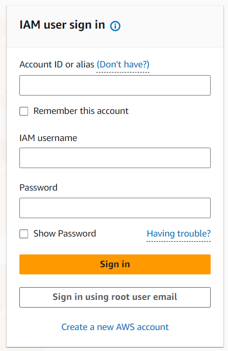
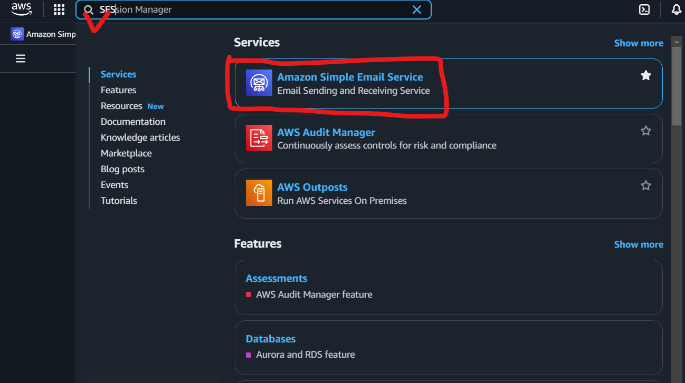
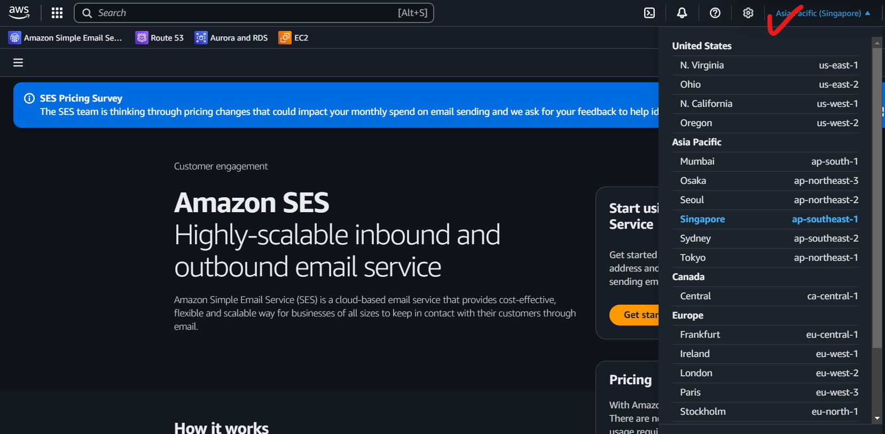
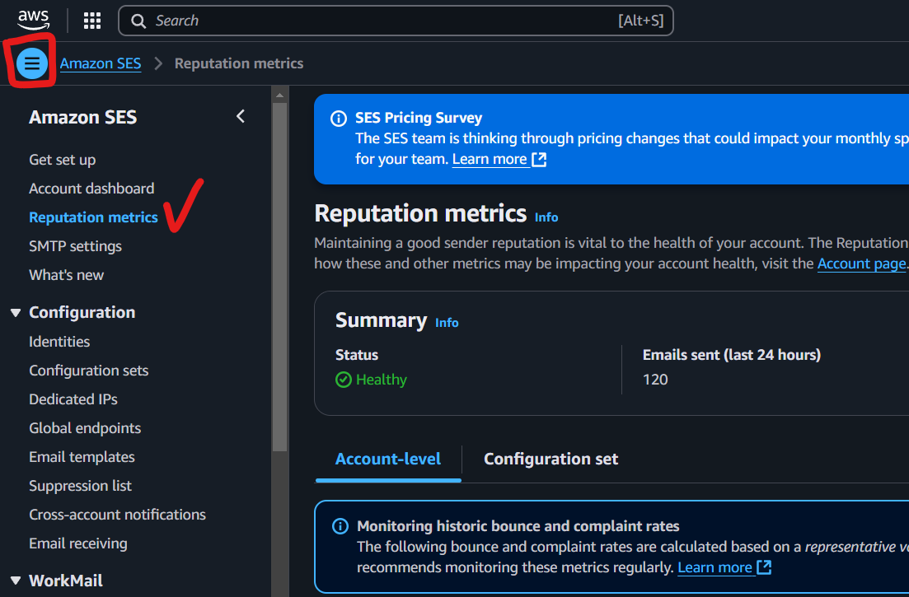
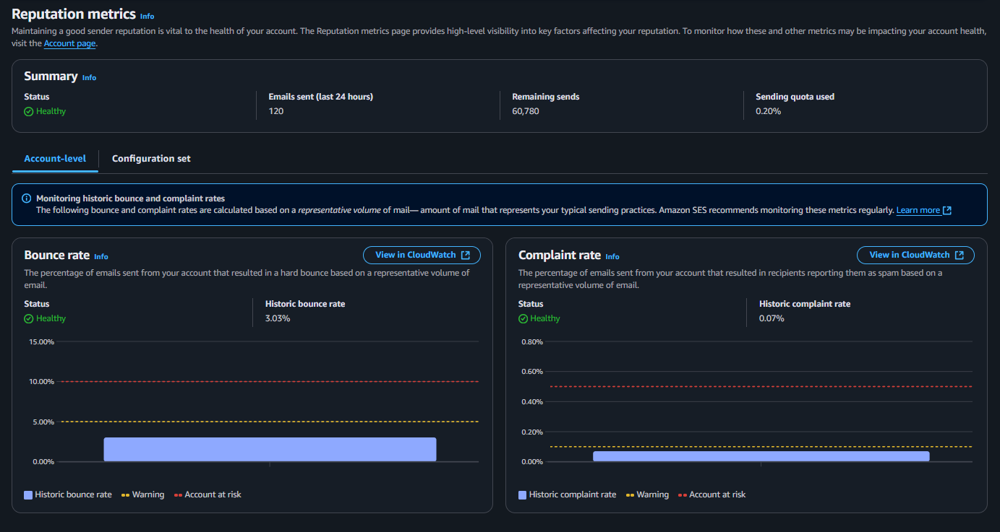

# AWS SES Reputation 指標查詢教學

本教學將帶你一步步學會如何在 AWS 管理主控台上查看 Simple Email Service (SES) 的 Reputation 相關指標。

## 什麼是 SES Reputation？

SES 的 Reputation 指標可以幫助你了解寄信品質，包括：
- 投遞率（Delivery Rate）
- 退信率（Bounce Rate）
- 投訴率（Complaint Rate）
- 送信到垃圾郵件夾的比率（Reputation Dashboard）

這些指標對於維持良好的寄信聲譽與信件到達率非常重要。

---

## 步驟一：登入 AWS 管理主控台
1. 前往 [AWS 管理主控台](https://aws.amazon.com/console/)
2. 輸入你的帳號與密碼登入

   

   **欄位說明：**
   - **Account ID or alias**：輸入你的 AWS 帳號 ID 或別名（Alias）。如果你是公司成員，請向管理員索取。
   - **IAM username**：輸入你的 IAM 使用者名稱。
   - **Password**：輸入你的密碼。
   - **Remember this account**：勾選後，下次登入會自動帶入帳號資訊。

   #### 補充：使用 Account ID URL 直接登入
   有時你會收到一個專屬的登入連結，例如：

   ```
   https://123456789012.signin.aws.amazon.com/console
   ```

   這種情況下，登入畫面會自動帶入 Account ID（或帳號別名），你會看到「Account ID or alias」欄位已經填好，無法修改。此時你只需要：

   1. 輸入你的 **IAM username**（IAM 使用者名稱）
   2. 輸入 **Password**（密碼）
   3. 點擊「Sign in」登入

   這種方式常見於公司或團隊提供的專屬登入連結，能避免手動輸入帳號 ID，降低輸入錯誤的機率，也提升安全性與便利性。

---

## 步驟二：進入 SES 服務
1. 在搜尋框輸入 `SES`，點選 `Simple Email Service`

   

2. 選擇你要查詢的區域（Region）

   

   **區域選擇說明：**
   - SES 的資料是依區域（Region）分開儲存的，請務必選擇你實際寄信的區域來查詢指標。
   - 圖片中紅色箭頭所指的位置，就是 AWS 管理主控台右上角的區域選擇器。
   - 常見區域如：新加坡（ap-southeast-1）、東京（ap-northeast-1）、美國東部（us-east-1）等。
   - 如果你在不同區域有啟用 SES，請分別切換區域查詢各自的 Reputation 指標。

---

## 步驟三：查看 Reputation Dashboard
1. 在左側選單點選 `Reputation dashboard`（聲譽儀表板）

   

   **操作說明：**
   - 若左側選單未展開，可點左上角的三條線（如圖紅色框處）展開選單。
   - 點選 `Reputation metrics`（如圖紅色勾勾處）即可進入 SES Reputation 指標頁面。

2. 你可以看到以下指標：

   

   **指標說明：**
   - **Emails sent（近 24 小時寄送量）**：這個數字是以 24 小時滑動區間計算，不是每天故定時間回復所有額度。例如今天寄出一封信，從寄出的那一刻起，這裡的扣打就會減一，必須等 24 小時後才會回補。每次寄信都會即時反映在這個數字上。
   - **Bounce rate（退信率）**：顯示寄出的信件中有多少比例被退回。過高的退信率會影響帳戶聲譽。
   - **Complaint rate（投訴率）**：收件人將信件標記為垃圾郵件的比例。投訴率過高也會影響帳戶健康。
   - **Reputation status（聲譽狀態）**：帳戶整體寄信健康狀態（如 Healthy、Warning、At risk）。
   - **Account status（帳戶狀態）**：帳戶目前是否可正常寄信。
   - **Suppression list（抑制名單）**：被系統自動封鎖、不再寄信的收件人清單。

---

## 步驟四：下載詳細指標（可選）
1. 點選 `Export` 或 `Download`，可將指標資料匯出為 CSV 進行進一步分析。

---

## 步驟五：自動化查詢（進階）
你也可以使用 AWS CLI 或 SDK 來查詢 SES Reputation 指標，例如：

```bash
aws sesv2 get-account
```

或使用 Python Boto3：

```python
import boto3
client = boto3.client('sesv2')
response = client.get_account()
print(response)
```

---

## 參考資料
- [AWS SES 官方文件](https://docs.aws.amazon.com/ses/latest/dg/monitor-sending-activity-dashboard.html)
- [Boto3 SESv2 文件](https://boto3.amazonaws.com/v1/documentation/api/latest/reference/services/sesv2.html)